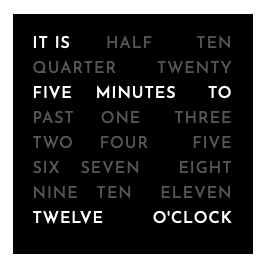

Word Clock using JavaScript
===============

I saw an image of a word clock pass through my Google Plus feed (goes to show how long ago that was)
and decided that it would be a great exercise to write a JavaScript object to generate one.

